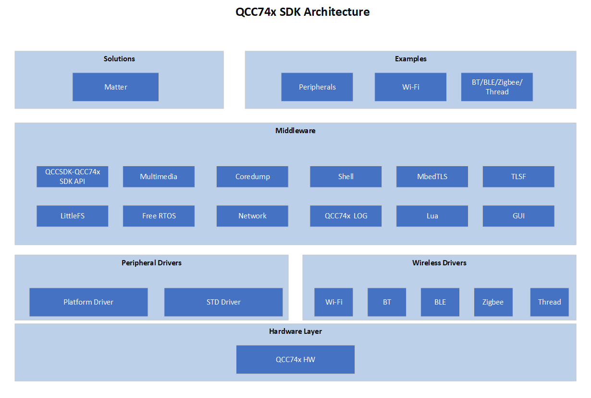

# Introduction

**qcc74xSDK** is the IOT and MCU software development kit provided by the Qualcomm Team, supports all the series of qcc74x chips.

# SDK Architecture



# Code Directories

| Name | Description |
|:---:|:------:|
| bsp/board |  clock, pinmux, memoryheap and console init |
| bsp/common | bsp common driver|
| components| components|
|docs | quick start、 api、demo doc|
|drivers/lhal| qcc74x common peripherals drivers which support all the chips|
|drivers/soc| qcc74x non-generic peripherals drivers|
|drivers/rfparam| rf param |
|examples| official samples|
|tools| tools |
|toolchain| SDK cross-compilation toolchain |

# LHAL Support

**LHAL** is a low level hal driver for common peripherals designed by Qualcomm, in order to support all the qcc74x chips with the same api . Also it is convenient for users to use and port to other platforms.

Note：**√** means supported ; **×** means not supported; **○** means supported but not tested ; **-** means no such peripheral.

|   Peripheral |qcc743/qcc744 |
|:------------:|-----------:|
|  ADC         |√           |
|  CAM         |√           |
|  CKS         |√           |
|  DAC         |√           |
|  DMA         |√           |
|  EFUSE       |×           |
|  EMAC        |√           |
|  FLASH       |√           |
|  GPIO        |√           |
|  I2C         |√           |
|  I2S         |√           |
|  IR          |√           |
|  MJPEG       |√           |
|  PWM_v1      |-           |
|  PWM_v2      |√           |
|  RTC         |√           |
|  SEC_AES     |√           |
|  SEC_SHA     |√           |
|  SEC_TRNG    |√           |
|  SEC_PKA     |√           |
|  SPI         |√           |
|  TIMER       |√           |
|  UART        |√           |
|  WDG         |√           |

# Wireless Support

|   Peripheral |qcc743/qcc744 |
|:------------:|-----------:|
|  WIFI6       |√           |
|  BT          |×           |
|  BLE         |√           |
|  ZIGBEE      |×           |

Note：**√** means supported ; **×** means not supported; **○** means supported but not tested ; **-** means no such peripheral.

# Environment Setup

## Toolchain

TODO

## Command Line Development

Before compiling with the command line, you need to select the corresponding toolchain according to your operating system, configure it to the system environment variables, and install the **make** or **ninja**, then you can do the following.

- Go to the demo directory where you want to compile and there are `main.c` and `Makefile` files in that directory
- Just execute the following command, take **qcc743** as an example

```
cd examples/helloworld
make CHIP=qcc743 BOARD=qcc743dk
```
If you want to use **ninja**, you can try:

```
cd examples/helloworld
make ninja CHIP=qcc743 BOARD=qcc743dk
```

## CDK Development

TODO

## Debug

TODO

## Firmware Download

Note that if you are using linux, linux will deny access to the serial device due to permission issues, so add your own username to `dialout` for easy to use, restart your linux and then take effect. Or add `sudo` before command.

```
usermod -aG dialout xxx # xxx is your own name
```

```
cd examples/helloworld
make flash CHIP=chip_name COMX=xxx # chip_name should be qcc743, COMX in Windows, /dev/ttyxxx in Linux
```

```
cd examples/helloworld
make flash CHIP=chip_name COMX=xxx # chip_name should be qcc743, COMX in Windows, /dev/ttyxxx in Linux
```

If flash using serial port rather than USB, different USB2TTL chips support different max baudrates, need to pay attention to when flashing.

| chip | baudrate|
|:---:|:------:|
| ch340 |  <= 500K |
| cp2102 |  <= 2M |
| ft232 |  <= 2M |

# Resources

## Video Tutorial

TODO

## LCD Support List

[LCD Support List](bsp/common/lcd/README.md)

## Cam Sensor Support List

[Cam Sensor Support List](bsp/common/image_sensor/README.md)

## License
Project source files are licensed under the [BSD-3-clause License](https://spdx.org/licenses/BSD-3-Clause.html). See [LICENSE_SOURCES](LICENSE_SOURCES) for the full license text.
Project binaries are licensed under the terms included at [LICENSE_BINARIES](LICENSE_BINARIES)
