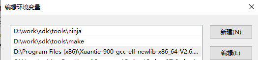
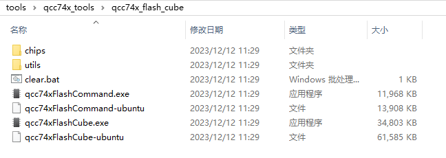
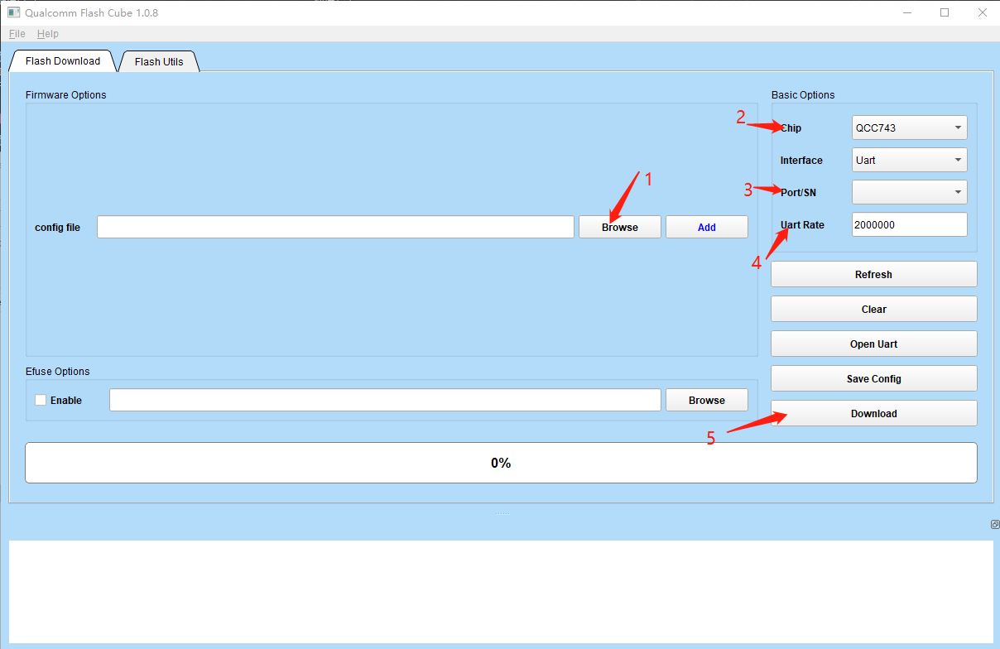

.. _get_started:

=======================
Environment Setup
=======================

This section mainly introduces the environment construction of qcc74x SDK, which supports Windows and Linux. For macos, please refer to linux. Before reading the following, you need to ensure that your computer has the git tool installed.

Install
========

qcc74x SDK compilation requires the use of the gcc tool chain, cmake, make, and ninja (optional, used to speed up code compilation) build system. The following describes how to install and configure.

Windows Environment
-------------------------------

- Download the GCC toolchain

- Install cmake

   No installation is required, the windows version cmake tool is already provided in the ``qcc74x_sdk/tools/cmake`` directory

- Install make

   No installation is required, the windows version make tool is already provided in the ``qcc74x_sdk/tools/make`` directory

- Install ninja

   No installation is required, the windows version of the ninja tool is already provided in the ``qcc74x_sdk/tools/ninja`` directory

- Configure environment variables

   Configure the make, ninja, and gcc tool chain paths into the system environment variables

- After completing the above steps, you need to check whether the installation is really successful. Open powershell or cmd and enter the following commands:

.. code-block:: bash
   :linenos:

   $ make -v

The following content should be displayed to indicate successful installation:

.. code-block:: bash
   :linenos:

    GNU Make 4.2.1
    Built for x86_64-w64-mingw32
    Copyright (C) 1988-2016 Free Software Foundation, Inc.
    License GPLv3+: GNU GPL version 3 or later <http://gnu.org/licenses/gpl.html>
    This is free software: you are free to change and redistribute it.
    There is NO WARRANTY, to the extent permitted by law.

.. code-block:: bash
   :linenos:

   $ riscv64-unknown-elf-gcc -v

The following content should be displayed to indicate successful installation:

.. code-block:: bash
   :linenos:

    Using built-in specs.
    COLLECT_GCC=riscv64-unknown-elf-gcc
    COLLECT_LTO_WRAPPER=/mnt/d/EmbeddedSoftware/Xuantie-900-gcc-elf-newlib-x86_64-V2.2.5/bin/../libexec/gcc/riscv64-unknown-elf/10.2.0/lto-wrapper
    Target: riscv64-unknown-elf
    Configured with: /lhome/software/toolsbuild/slave2/workspace/Toolchain/build-gnu-riscv_4/./source/riscv/riscv-gcc/configure --target=riscv64-unknown-elf --with-gmp=/lhome/software/toolsbuild/slave2/workspace/Toolchain/build-gnu-riscv_4/build-riscv-gcc-riscv64-unknown-elf/build-Xuantie-900-gcc-elf-newlib-x86_64-V2.2.5/lib-for-gcc-x86_64-linux --with-mpfr=/lhome/software/toolsbuild/slave2/workspace/Toolchain/build-gnu-riscv_4/build-riscv-gcc-riscv64-unknown-elf/build-Xuantie-900-gcc-elf-newlib-x86_64-V2.2.5/lib-for-gcc-x86_64-linux --with-mpc=/lhome/software/toolsbuild/slave2/workspace/Toolchain/build-gnu-riscv_4/build-riscv-gcc-riscv64-unknown-elf/build-Xuantie-900-gcc-elf-newlib-x86_64-V2.2.5/lib-for-gcc-x86_64-linux --with-libexpat-prefix=/lhome/software/toolsbuild/slave2/workspace/Toolchain/build-gnu-riscv_4/build-riscv-gcc-riscv64-unknown-elf/build-Xuantie-900-gcc-elf-newlib-x86_64-V2.2.5/lib-for-gcc-x86_64-linux --with-libmpfr-prefix=/lhome/software/toolsbuild/slave2/workspace/Toolchain/build-gnu-riscv_4/build-riscv-gcc-riscv64-unknown-elf/build-Xuantie-900-gcc-elf-newlib-x86_64-V2.2.5/lib-for-gcc-x86_64-linux --with-pkgversion='Xuantie-900 elf newlib gcc Toolchain V2.2.5 B-20220323' CXXFLAGS='-g -O2 -DTHEAD_VERSION_NUMBER=2.2.5' --enable-libgcctf --prefix=/lhome/software/toolsbuild/slave2/workspace/Toolchain/build-gnu-riscv_4/build-riscv-gcc-riscv64-unknown-elf/Xuantie-900-gcc-elf-newlib-x86_64-V2.2.5 --disable-shared --disable-threads --enable-languages=c,c++ --with-system-zlib --enable-tls --with-newlib --with-sysroot=/lhome/software/toolsbuild/slave2/workspace/Toolchain/build-gnu-riscv_4/build-riscv-gcc-riscv64-unknown-elf/Xuantie-900-gcc-elf-newlib-x86_64-V2.2.5/riscv64-unknown-elf --with-native-system-header-dir=/include --disable-libmudflap --disable-libssp --disable-libquadmath --disable-libgomp --disable-nls --disable-tm-clone-registry --src=/lhome/software/toolsbuild/slave2/workspace/Toolchain/build-gnu-riscv_4/./source/riscv/riscv-gcc --enable-multilib --with-abi=lp64d --with-arch=rv64gcxthead 'CFLAGS_FOR_TARGET=-Os   -mcmodel=medany' 'CXXFLAGS_FOR_TARGET=-Os   -mcmodel=medany'
    Thread model: single
    Supported LTO compression algorithms: zlib
    gcc version 10.2.0 (Xuantie-900 elf newlib gcc Toolchain V2.2.5 B-20220323)

Linux Environment
------------------------

- Download the GCC toolchain

- Install cmake

    No installation is required, the linux version of the cmake tool is already provided in the ``qcc74x_sdk/tools/cmake`` directory

- Install make

.. code-block:: bash
   :linenos:
   :emphasize-lines: 1

   $ cd ~
   $ sudo apt install make -y

- Install ninja

.. code-block:: bash
   :linenos:
   :emphasize-lines: 1

   $ cd ~
   $ sudo apt install ninja-build -y

- Configure environment variables

   After the above installation is completed, the system environment variables have been configured and no manual configuration is required.

- After completing the above steps, you need to check whether the installation is successful. Enter the following command in the Linux terminal:

.. code-block:: bash
   :linenos:

   $ make -v

The following content should be displayed to indicate successful installation:

.. code-block:: bash
   :linenos:

    GNU Make 4.1
    Built for x86_64-pc-linux-gnu
    Copyright (C) 1988-2014 Free Software Foundation, Inc.
    License GPLv3+: GNU GPL version 3 or later <http://gnu.org/licenses/gpl.html>
    This is free software: you are free to change and redistribute it.
    There is NO WARRANTY, to the extent permitted by law.

.. code-block:: bash
   :linenos:

   $ riscv64-unknown-elf-gcc -v

The following content should be displayed to indicate successful installation:

.. code-block:: bash
   :linenos:

    Using built-in specs.
    COLLECT_GCC=riscv64-unknown-elf-gcc
    COLLECT_LTO_WRAPPER=/mnt/d/EmbeddedSoftware/Xuantie-900-gcc-elf-newlib-x86_64-V2.2.5/bin/../libexec/gcc/riscv64-unknown-elf/10.2.0/lto-wrapper
    Target: riscv64-unknown-elf
    Configured with: /lhome/software/toolsbuild/slave2/workspace/Toolchain/build-gnu-riscv_4/./source/riscv/riscv-gcc/configure --target=riscv64-unknown-elf --with-gmp=/lhome/software/toolsbuild/slave2/workspace/Toolchain/build-gnu-riscv_4/build-riscv-gcc-riscv64-unknown-elf/build-Xuantie-900-gcc-elf-newlib-x86_64-V2.2.5/lib-for-gcc-x86_64-linux --with-mpfr=/lhome/software/toolsbuild/slave2/workspace/Toolchain/build-gnu-riscv_4/build-riscv-gcc-riscv64-unknown-elf/build-Xuantie-900-gcc-elf-newlib-x86_64-V2.2.5/lib-for-gcc-x86_64-linux --with-mpc=/lhome/software/toolsbuild/slave2/workspace/Toolchain/build-gnu-riscv_4/build-riscv-gcc-riscv64-unknown-elf/build-Xuantie-900-gcc-elf-newlib-x86_64-V2.2.5/lib-for-gcc-x86_64-linux --with-libexpat-prefix=/lhome/software/toolsbuild/slave2/workspace/Toolchain/build-gnu-riscv_4/build-riscv-gcc-riscv64-unknown-elf/build-Xuantie-900-gcc-elf-newlib-x86_64-V2.2.5/lib-for-gcc-x86_64-linux --with-libmpfr-prefix=/lhome/software/toolsbuild/slave2/workspace/Toolchain/build-gnu-riscv_4/build-riscv-gcc-riscv64-unknown-elf/build-Xuantie-900-gcc-elf-newlib-x86_64-V2.2.5/lib-for-gcc-x86_64-linux --with-pkgversion='Xuantie-900 elf newlib gcc Toolchain V2.2.5 B-20220323' CXXFLAGS='-g -O2 -DTHEAD_VERSION_NUMBER=2.2.5' --enable-libgcctf --prefix=/lhome/software/toolsbuild/slave2/workspace/Toolchain/build-gnu-riscv_4/build-riscv-gcc-riscv64-unknown-elf/Xuantie-900-gcc-elf-newlib-x86_64-V2.2.5 --disable-shared --disable-threads --enable-languages=c,c++ --with-system-zlib --enable-tls --with-newlib --with-sysroot=/lhome/software/toolsbuild/slave2/workspace/Toolchain/build-gnu-riscv_4/build-riscv-gcc-riscv64-unknown-elf/Xuantie-900-gcc-elf-newlib-x86_64-V2.2.5/riscv64-unknown-elf --with-native-system-header-dir=/include --disable-libmudflap --disable-libssp --disable-libquadmath --disable-libgomp --disable-nls --disable-tm-clone-registry --src=/lhome/software/toolsbuild/slave2/workspace/Toolchain/build-gnu-riscv_4/./source/riscv/riscv-gcc --enable-multilib --with-abi=lp64d --with-arch=rv64gcxthead 'CFLAGS_FOR_TARGET=-Os   -mcmodel=medany' 'CXXFLAGS_FOR_TARGET=-Os   -mcmodel=medany'
    Thread model: single
    Supported LTO compression algorithms: zlib
    gcc version 10.2.0 (Xuantie-900 elf newlib gcc Toolchain V2.2.5 B-20220323)

Compile
========

qcc74x SDK compiled code provides two compilation methods: make and ninja

- Compile using make

.. code-block:: bash
   :linenos:

    $ cd examples/helloworld
    $ make CHIP=chip_name BOARD=board_name ## chip_name is the chip model, you can fill in qcc743, board_name is the name of the development board, see the bsp/board directory for details

- Compiled using ninja

.. code-block:: bash
   :linenos:

    $ cd examples/helloworld
    $ make ninja CHIP=chip_name BOARD=board_name ## chip_name is the chip model, you can fill qcc743, board_name is the name of the development board, see the bsp/board directory for details

.. caution :: For chip_name, if it is from the same series, only fill in the name of the chip with the fewest pins. For example, if using qcc744, fill in qcc743.

Program
========

qcc74x SDK provides two types of programming code: command line and interface. It should be noted that if you use a third-party USB to serial port module, some do not support 2M baud rate programming, such as CH340, please lower the baud rate (less than 500K)

.. note :: Before programming, make sure the chip enters the programming mode: hold down the boot pin, press the reset pin, release the reset pin, and then release the boot pin to enter the programming mode.

- Command line programming

.. code-block:: bash
   :linenos:

    $ cd examples/helloworld
    $ make flash CHIP=chip_name COMX=port_name ## port_name is the serial port name

.. caution :: If using WSL, please use the Windows version for programming.

- Programming interface

For Windows environment, please use the file with .exe suffix, and the rest are the same.

- Double click to open
- Click Broswe to import the programming file (located under each demo, named flash_prog_cfg.ini)
- Select chip model
- Select the serial port number for programming
- Select baud rate
- Click to download
- The interface prompts green 100% to indicate that the programming is completed
- If the programming fails, please check whether the programming port is correct, whether the chip enters programming mode, whether the power supply is normal, and whether the USB to serial port module supports the set baud rate.

Run
========

After the programming is completed, press the reset button, the program will run, and you can use the serial port tool to view the log. The default baud rate is 2M. It is recommended to use the Microsoft Store Serial Port Debugging Assistant or mobaxterm

Version Information
---------------------------
When the system starts, the SDK and version number information of each module will be output.
For example: Version: component_version_macsw_xxx.

You can also obtain the version information of each module through the "sysver" command line:

.. code-block:: shell
   :linenos:

   > sysver
   Version of used components:
         Version: component_version_macsw_1.6.10
         Version: component_version_sdk_868f923d-dirty

Debug
========

qcc74x SDK currently supports debugging using openocd.

JTAG PIN List
-----------------------

.. list-table::
    :widths: 50 50
    :header-rows: 1

    * - CHIP/Pin
      - QCC743/QCC744
    * - TMS
      - GPIO0
    * - TCK
      - GPIO1
    * - TDO
      - GPIO2
    * - TDI
      - GPIO3

