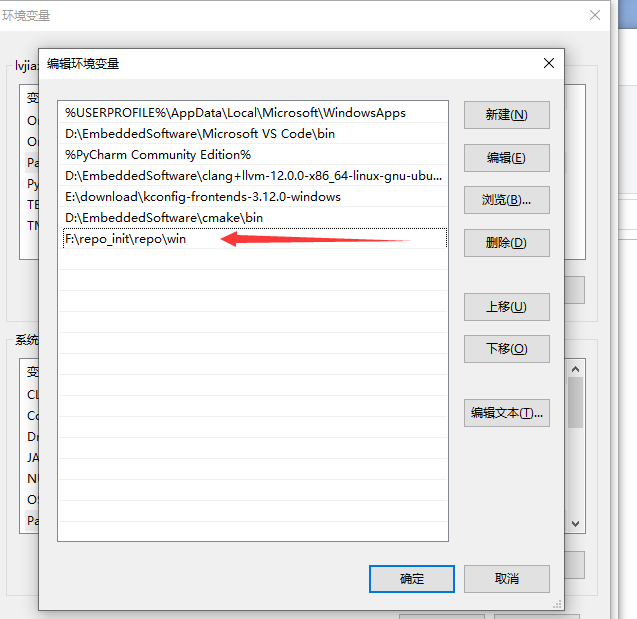

Usage of Repo
=======================

Repo is a script written by Google using Python script to call git. It can manage multiple git libraries. With a few simple lines of commands, you can pull the code of many warehouses.

Install
--------

- Download repo.

- Under Windows, configure the path where the ``repo.exe`` file (in the win directory) is located to the system environment variable.

- Execute the following command under Linux

.. code-block:: bash
   :linenos:

    cd repo/linux
    chmod +x repo
    mv repo /usr/bin/repo

Download Code
--------------------

Please contact Business to apply for an account.

Sync Code
----------

Subsequently, you only need to use ``repo sync`` to synchronize the code.
