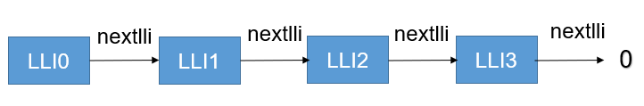
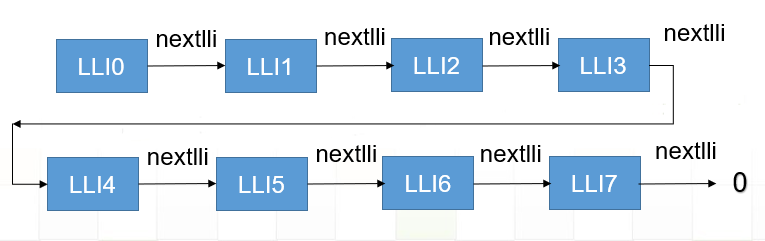

DMA Linked List Mode (LLI) In-depth Analysis
===================================================

The DMA feature in the QCC74x series chips supports Linked List Mode (LLI).

Multiple linked lists can be configured when performing a DMA read or write operation. This allows for seamless data transfers by automatically jumping to the starting address of the next linked list when the data transfer of the current linked list is completed. The process continues until the next address in the linked list becomes 0. If the DMA completion interrupt is enabled, an interrupt will be triggered when the DMA transmission or reception is completed.

.. figure:: img/dma_lli.svg
   :alt:

With the DMA linked list mode, we can achieve the following functionalities:

- DMA transmission or reception with unlimited length
- Non-contiguous DMA source and destination addresses
- Support for various interrupt modes such as half-interrupt, 3-interrupt, 4-interrupt, and so on
- Support for loop functionality in DMA transfers

Before we dive into the configuration of linked lists, there are a few prerequisites to understand:

- Each linked list can transfer a maximum of 4095 units of data, with the unit size determined by the data width.
- Each linked list can trigger an interrupt upon completion.

Support for Unlimited Length
---------------------------------------

Since each DMA linked list supports a maximum of 4095 units, let's assume the unit size is in bytes. In that case, a single linked list can transfer a maximum of 4095 bytes. Clearly, this is insufficient for our requirements and would result in poor performance. So, how can we increase the transfer length?

We can achieve longer transfers by using multiple linked lists connected in series. This allows us to support larger transfer lengths while maintaining contiguous addresses. The DMA linked list connection is illustrated in the diagram below:

There is another issue to consider. When one linked list uses 4095 bytes and the next linked list starts from an offset of 4095, it can lead to misalignment. This can be problematic, especially in cache scenarios.

To address this, we reduce the maximum length from 4095 to 4064. This ensures that the starting address of each linked list is aligned to a 32-byte boundary. By doing so, we achieve the functionality of unlimited length transfers. For detailed implementation, please refer to the ``qcc74x_dma_lli_config`` function.

.. code-block:: c
   :linenos:

   void qcc74x_dma_lli_config(struct qcc74x_device_s *dev, struct qcc74x_dma_channel_lli_pool_s *lli_pool, uint32_t lli_count, uint32_t src_addr, uint32_t dst_addr, uint32_t transfer_offset, uint32_t last_transfer_len)
   {
       uint32_t channel_base;
       union qcc74x_dma_lli_control_s dma_ctrl_cfg;

       channel_base = dev->reg_base;

       dma_ctrl_cfg = (union qcc74x_dma_lli_control_s)getreg32(channel_base + DMA_CxCONTROL_OFFSET);

       dma_ctrl_cfg.bits.TransferSize = 4064;
       dma_ctrl_cfg.bits.I = 0;

       /* nbytes will be integer multiple of 4064*n or 4064*2*n or 4064*4*n,(n>0) */
       for (uint32_t i = 0; i < lli_count; i++) {
           lli_pool[i].src_addr = src_addr;
           lli_pool[i].dst_addr = dst_addr;
           lli_pool[i].nextlli = 0;

           if (dma_ctrl_cfg.bits.SI) {
               src_addr += transfer_offset;
           }

           if (dma_ctrl_cfg.bits.DI) {
               dst_addr += transfer_offset;
           }

           if (i == lli_count - 1) {
               dma_ctrl_cfg.bits.TransferSize = last_transfer_len;
               dma_ctrl_cfg.bits.I = 1;
           }

           if (i) {
               lli_pool[i - 1].nextlli = (uint32_t)(uintptr_t)&lli_pool[i];
           }

           lli_pool[i].control = dma_ctrl_cfg;
       }
   }

Support for non-contiguous Addresses
----------------------------------------------
Earlier, we addressed the issue of length limitation. Now, let's discuss how DMA linked lists inherently support non-contiguous addresses. We can treat the multiple linked lists we used for achieving unlimited length as one large linked list. By concatenating two large linked lists together and ensuring that the starting addresses of the two linked lists are non-contiguous, we can achieve non-contiguous address transfers.

For specific implementation details, please refer to the ``qcc74x_dma_channel_lli_reload`` function and the ``qcc74x_dma_channel_lli_transfer_s`` structure. The DMA linked list connection is illustrated in the diagram below:

Support for Multiple Interrupts
----------------------------------------
After completing the aforementioned steps, support for multiple interrupts is achieved.

Once we enable unlimited length transfers, the last linked list in the chain will enable an interrupt. This interrupt will be triggered when the transfer of the last linked list is completed.

Furthermore, after enabling support for non-contiguous addresses, completion of each large linked list (which corresponds to the last linked list of unlimited length transfers) will also trigger an interrupt. For instance, if we configure three transfers using ``qcc74x_dma_channel_lli_transfer_s``, it will result in three DMA completion interrupts.

Support for Loop Mode
---------------------
