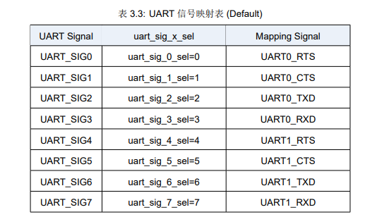

UART Pin Mapping in Detail
===============================

Each pin on the qcc74x series chips can be configured to function as any UART signal. This flexible configuration can lead to some pitfalls, such as multiple pins being assigned to the same UART function.

Let's discuss how to properly understand the statement `each pin can be configured to function as any UART signal` and how to avoid pitfalls. Lastly, we will provide an overview of the implementation of the ``qcc74x_gpio_uart_init`` function.

UART SIG
-------------------

In the qcc74x series chips, there is the concept of `UART SIG`. Each SIG corresponds to all functions of UART, and its function is similar to an 8-to-1 selector or a 12-to-1 selector. And each SIG has a default UART function, as shown in the figure:

2 pins selected a SIG
^^^^^^^^^^^^^^^^^^^^^^

Each GPIO corresponds to a SIG, and the corresponding relationship is related to the chip. For example, qcc743/qcc744_undef is mod 12. A problem will arise at this time. **There is a possibility of duplication**. **Assuming that the relationship is mod 8, both GPIO0 and GPIO8 correspond to SIG0. If GPIO0 is configured with a UART function, GPIO8 can no longer be used. Otherwise, there will be a situation where two GPIOs share the same function**.

2 SIGs selected a UART function
^^^^^^^^^^^^^^^^^^^^^^^^^^^^^^^

In order to facilitate the software, all the default functions in the code are changed to `0xF`, and all SIGs point to a function that has no effect. Why do this?

Assume that GPIO2 uses UART0 TX by default. At this time, I want to use GPIO6 as UART0 TX. After configuring GPIO6 as UART0 TX in my software, what is the function of GPIO2? That's right, it's still UART0 TX, and there is a problem at this time.

qcc74x_gpio_uart_init
--------------------------

In response to the above two problems, ``qcc74x_gpio_uart_init`` appeared. The function of this function is to avoid `two SIGs selecting a UART function`. If it appears, the later configuration will overwrite the previous one.
For `2 pins, selecting a SIG` cannot be avoided by software and can only be avoided manually.

