BLE MESH
====================

This section mainly introduces the use of BLE mesh, using ble mesh to network and control LED switches.

Hardware Preparation
-----------------------------

- Install `nordic app <https://www.nordicsemi.com/Products/Development-tools/nRF-Mesh>`_
- pc terminal tool: xshell or mobaxterm

Hardware Connection
-----------------------------

none

Software Implementation
-----------------------------

For more detailed code, please refer to **examples/btble/blemesh_cli**

Compile and Program
-----------------------------

Reference :ref:`get_started`

Experimental Phenomena
-----------------------------

- Open the terminal tool, select the serial port, reset the chip, and hit Enter. It will show that the shell function is normal.
- Enter ``blemesh_init`` and ``blemesh_pb 2 1``
- If prompted Failed to enable PB-GATT (err -120), enter the ``blemesh_reset`` command to reset
- At this point the chip side initialization is completed.
- Open nRF mesh app, click **+**

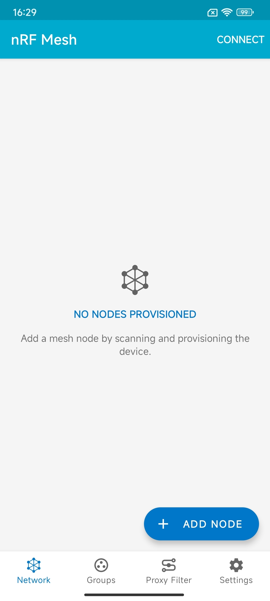

- Scan out the BLE name and mac address of the chip, click on the name to connect

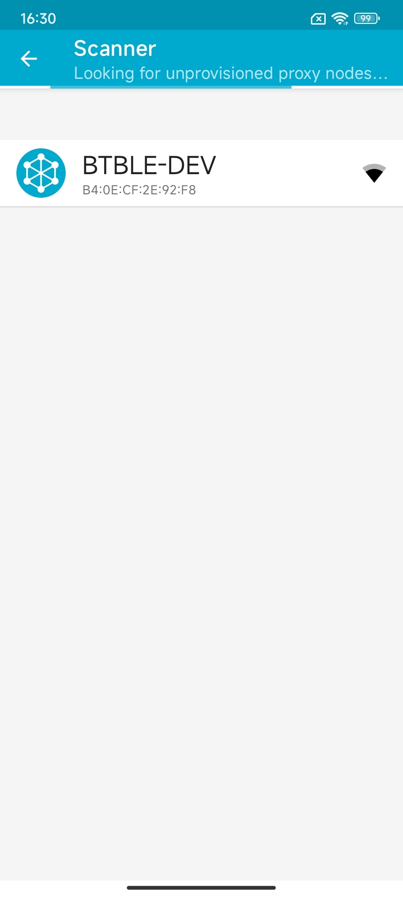

- After the connection is completed, click **Authentication**

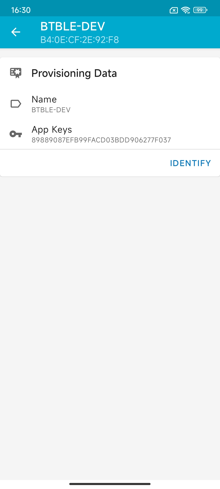

- After the identification is completed, click **Requirements**, an option will pop up, click **OK**

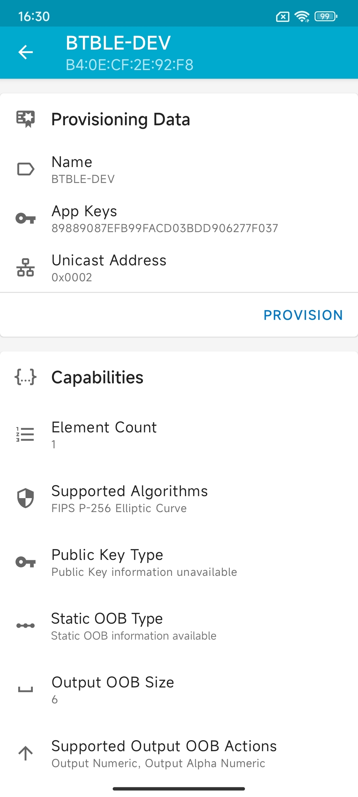

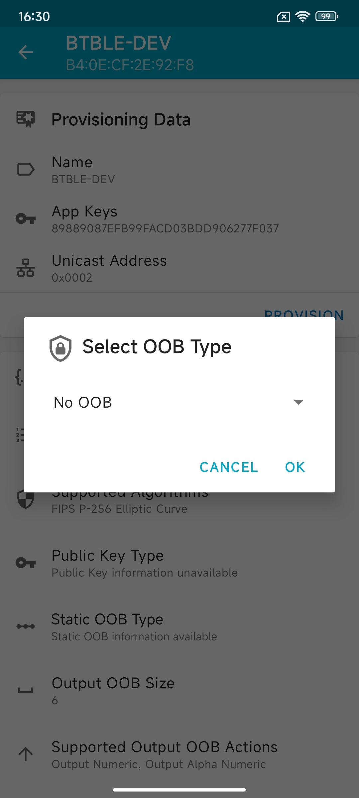

- After the stipulation is completed, an option will pop up, click **OK**

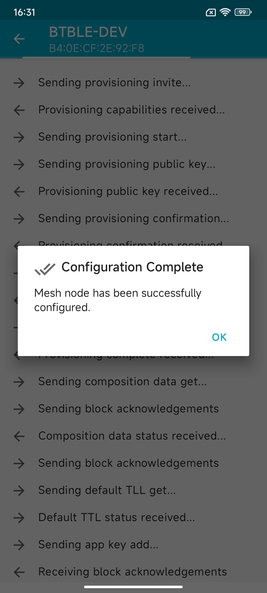

- After the configuration is completed, the network menu item will display the connected BLE device. At this time, click on the BLE device

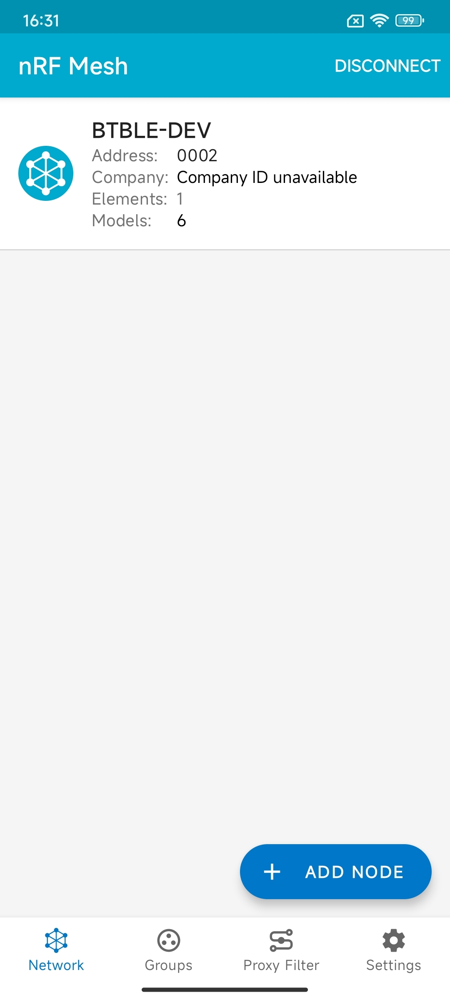

- Click the drop-down box of the molecule menu and click **Generic On Off Server**

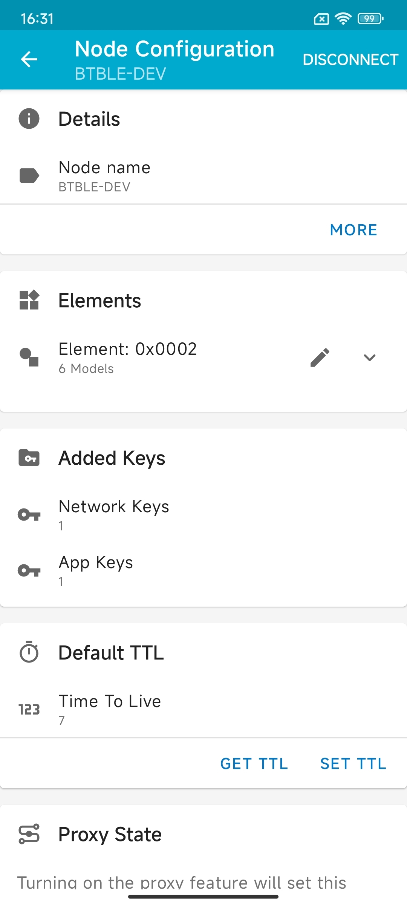

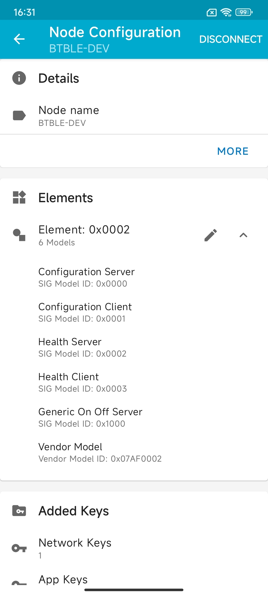

- Click **Bind Key**, click **Application Key 1**

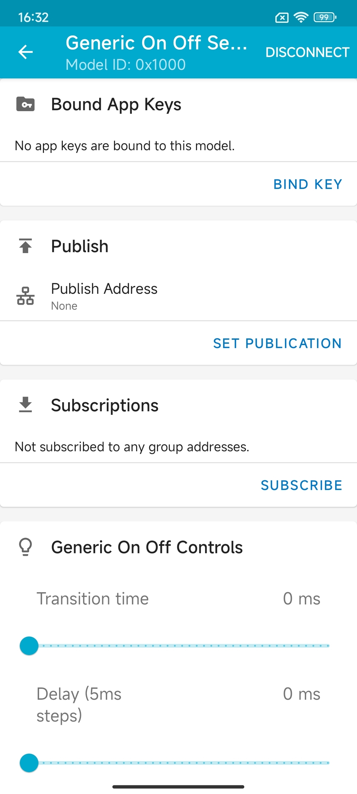

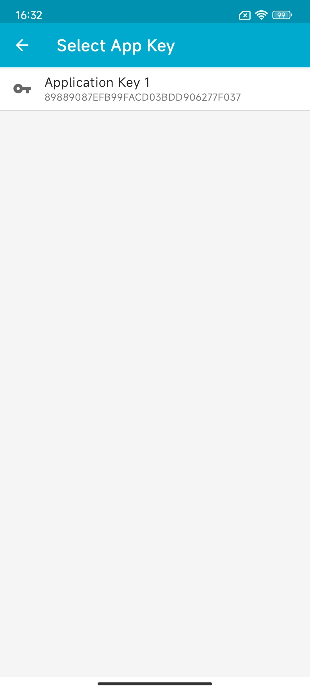

- Scroll down to the bottom and click **Up** or **Close** to send the switch command to the BLE device. The serial port of the BLE device will print out the value of the switch command.

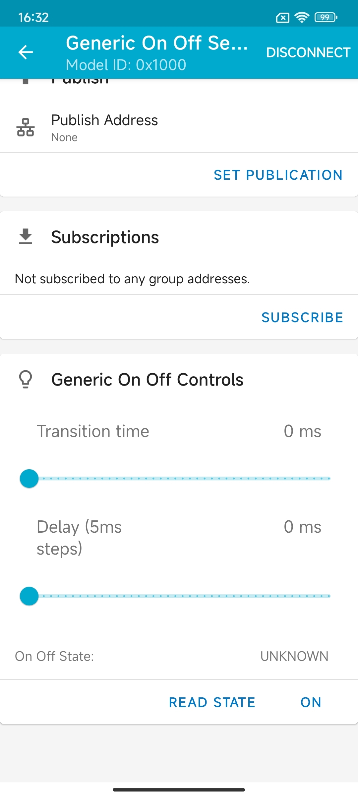

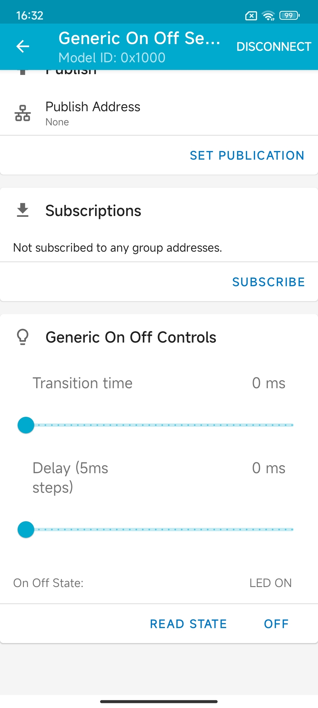

.. figure:: img/blemesh16.png
    :alt:

- Click **Subscribe** on the current interface of the APP. If there is no group currently, create a group and click **OK**. If the group already exists, use the existing group so that the device is in the same network.

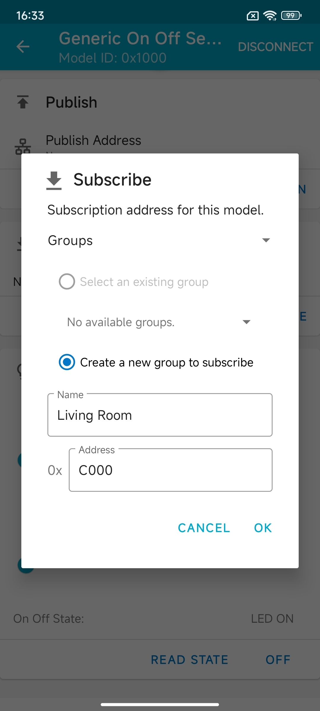

- Click on the **Group** interface and click on the created group. The LED switch interface will be displayed. Click **Up** or **Close** to send the switch command to the BLE device. If there are multiple BLE devices, it will be sent to all BLE devices

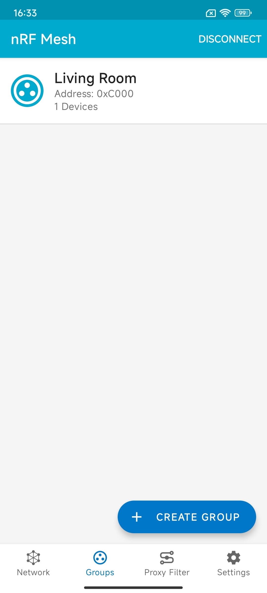

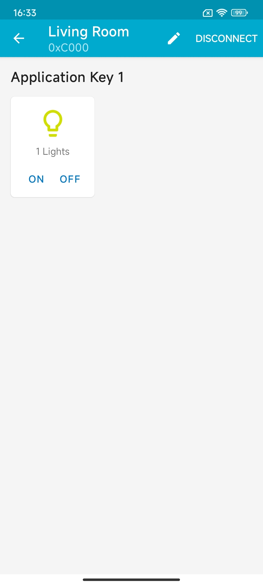

- If you need to add multiple BLE devices for networking, you only need to repeat the above steps and add them to a group
