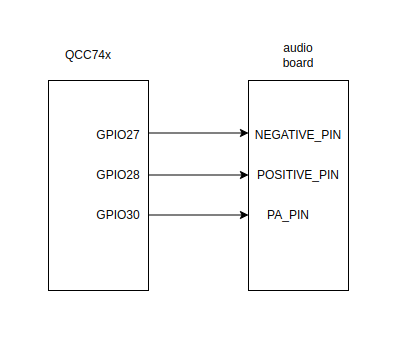
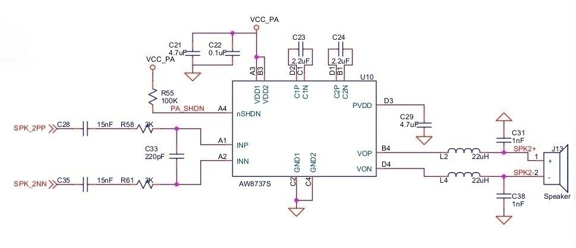

# Player A2DP [中文](README_zh.md)

**Note**: Up to the latest update of the document, the coexistence of wifi/bt on qcc743 has not been ported yet. Therefore, playing Bluetooth audio while streaming music via wifi, or vice versa, may cause unknown issues. Please stay tuned for future updates.

## Supported CHIPs

|      CHIP        | Remark |
|:----------------:|:------:|
|qcc743/qcc744       |        |

## Compilation

- For qcc743/qcc744

```
make
```

## Flashing
make flash CHIP=qcc743 COMX=/dev/ttyACM0

## Hardware connectivity



The hardware connection is shown in the figure above: GPIO27 of QCC74x is connected to the Negative Pin of the audio board, GPIO28 is connected to the Positive Pin of the audio board. GPIO30 is connected to the PA Pin of the audio board. The figure below is the schematic circuit of the audio board: Negative Pin corresponds to SPK_2NN in the circuit, Positive Pin corresponds to SPK_2PP in the circuit. PA Pin corresponds to PA_SHDN in the circuit.



## Run

### Enable Bluetooth Advertising on the Device

```
qxx74x />smta a2dp 1
```

### Connect and Play Music from a Mobile Device
Turn on Bluetooth on your mobile phone.
Search for and connect to a device named similar to "qxx74xMSP[XX:XX:XX]" to enable Bluetooth audio streaming.

### Disable Bluetooth Advertising on the Device

```
qxx74x />smta a2dp 0
```
