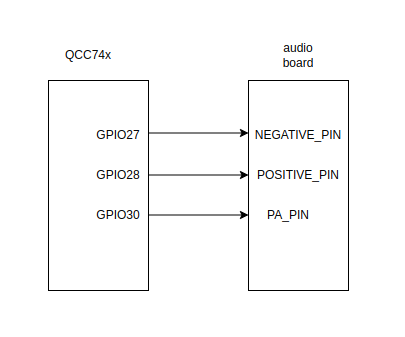
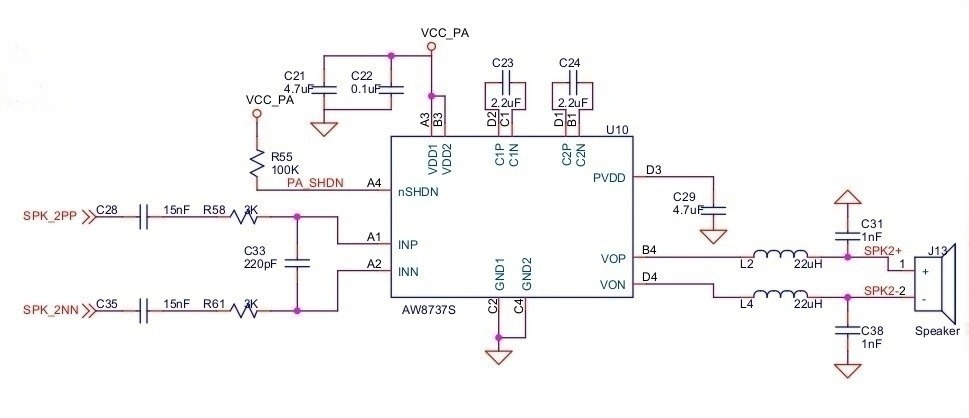

# player a2dp [English](README.md)

**特别说明**: 截止到的更新文档为止，QCC743的wifi/bt共存暂时没有移植，因此如果wifi播放音乐的过程中播放蓝牙音乐，均可能会引发未知异常，反之如此。敬请期待后续的更新。

## 芯片支持列表

|      芯片        | 备注    |
|:----------------:|:------:|
|QCC743/QCC74x_undef       |        |
|QCC74x_undefp/QCC74x_undef      |        |

## 编译

- QCC743/QCC74x_undef

```
make
```

## 烧录

```
make flash CHIP=qcc743 COMX=/dev/ttyACM0
```

## 硬件连接



硬件连接如上图所示：其中QCC74x的GPIO27与音频板的Negative Pin脚连接，GPIO28与音频板的Positive Pin脚连接。GPIO30与音频板的PA Pin脚连接。下图是音频板的示意电路：Negative Pin对应电路中的SPK_2NN，Positive Pin对应电路中的SPK_2PP。PA Pin对应电路中的PA_SHDN。



## 运行

### 启动蓝牙广播

```
qcc74x />smta a2dp 1
```

### 手机连接并播放音乐
手机打开蓝牙，查找并连接类似qcc74xMSP[XX:XX:XX]这样命名的设备，即可蓝牙播放音乐

### 关闭蓝牙广播

```
qcc74x />smta a2dp 0
```
