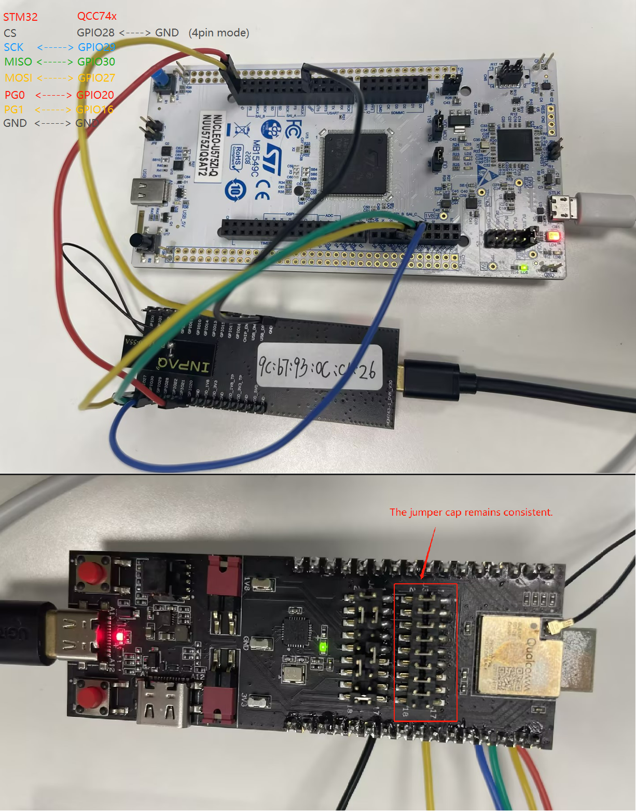
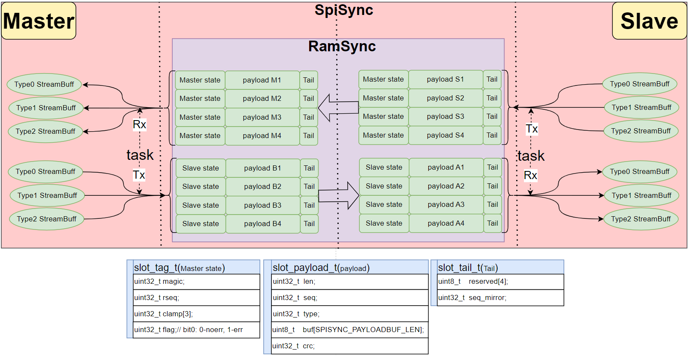
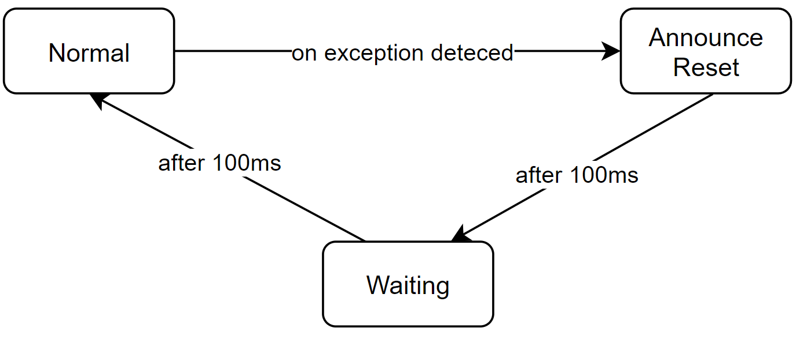
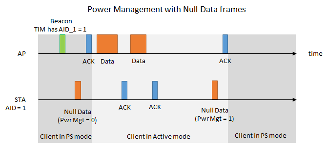
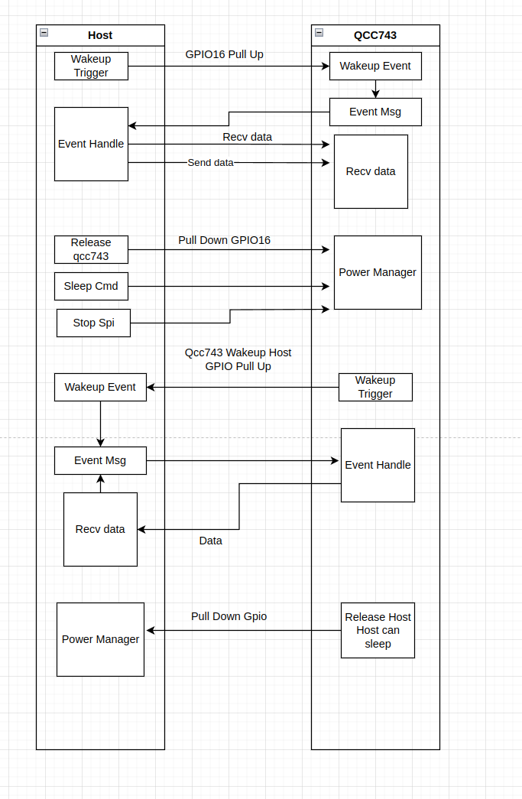
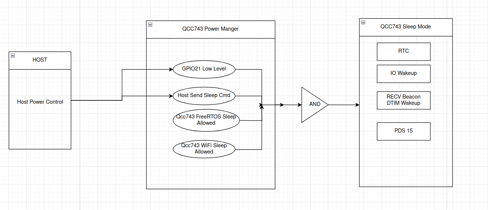
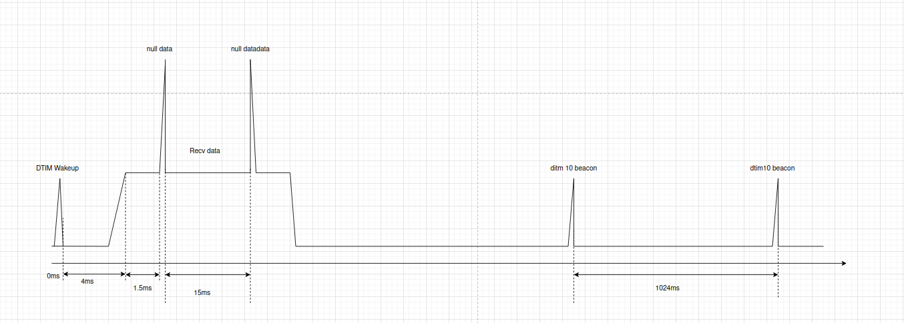
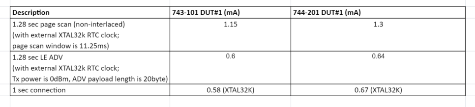

# README

# Spi WiFi Configuration and Usage

## How to Connect an STM32 Board and a QCC74x Board Using Jumper Wires

The hardware wiring diagram between the STM32 HOST and QCC74X is shown in the figure. Note: If the CONFIG_SPI_3PIN_MODE_ENABLE macro is enabled in the software (which is enabled by default), then the SPI communication does not need to consider the GPIO16 (CS) pin of the QCC74X.

### QCC743

#### Jumper Wires

If you are using the QCC743/QCC744 development board, please connect the jumpers as follows：



#### Compile

Compile spiwifi porject:

```bash
make 
```

### Flashing

To flash your project onto the target device, use the following command, where `xxx` is your serial port name:

```bash
make flash COMX=xxx # xxx is your com port name
```

## Low Power Mode Configuration and Usage

To enable low power mode, you need to set the `CONFIG_USE_LPAPP` variable in your configuration. This can be done by uncommenting or adding the following line in your project's configuration file:

```bash
set(CONFIG_USE_LPAPP 1)
```

After making the necessary changes, you need to recompile your project:

```bash
make
```

## How to Test PWR Mode

### PWR Mode Commands

Reference: atmoudle.rst

All commands about low power in atmoudle.rst are supported

#### AT+PWR Command

Command Format:

```bash
AT+PWR=<power mode>[,<level>]
```

Response:

```bash
OK
```

Parameters:

- `<power mode>`:

  - 0: normal mode.
  - 1: hibernate mode.
  - 2: standby mode.
- `[<level>]`: In hibemate mode, power level ranging from 0 to 2. default value is 0.

#### Examples

```bash
AT+PWR=0              // Normal mode
AT+PWR=1              // Hibernate mode, level 0.
AT+PWR=2              // Standby mode.
```

### Testing PWR Mode

#### Pre-Testing Steps

1. Connect an stm32 board and a qcc74x board using jumper wires.
2. Use a power analyzer to supply power to the qcc74x board.
3. Reset stm32 board and qcc74x board.
4. As shown in the image, use a micro USB cable to connect the STM32 demo board to a PC. Open a PC serial port tool. Set the serial port baud rate to 961200.

#### Testing PWR Step

1. Execute the command `AT+PWR=1`
2. You can see that the current has decreased, and then measure the subsequent average power consumption.

#### Testing IO Wakeup(support gpio 28, 29. only supoport standby mode now)

1. Reset the demo board.
2. Execute the command `AT+SLWKIO=16,0` in serial port tool.
3. Execute the command `AT+PWR=2` in serial port tool.
4. Execute the command `HOSTCMD wakeup 28` in serial port tool.

NOTE:Currently, edge wake-up is not supported. Edge awakening will be supported in the future.

#### Testing Timer Wakeup from standby mode.

1. Reset the demo board.
2. Execute the command `AT+SLWKTIMER=0,5000` in serial port tool.
3. Execute the command `AT+PWR=2` in serial port tool.

#### Testing Timer Wakeup from hibernate mode.

1. Reset the demo board.
2. Execute the command `AT+SLWKTIMER=1,5000` in serial port tool.
3. Execute the command `AT+PWR=1` in serial port tool.

#### Testing DTIM Step

1. Reset the demo board.
2. Connect to the Access Point (AP).
3. Execute the command `AT+SLWKDTIM=10` in serial port tool.
4. Execute the command `AT+PWR=2` (enter standby mode) in serial port tool.
5. You can see that the current has decreased, and then measure the subsequent average power consumption.

## OTA Test

Ensure that the PC and qcc74x are connected to the same router.

### PC Command

1. Enable TCP server on the PC side and specify the OTA file for transmission.

   Execute commands in the directory examples/wifi/spi_wifi:

   ```bash
   ncat -klp 3365 < build/build_out/spi_wifi_qcc743.bin.ota
   ```

### HOST UART Command

2. Query OTA partition status

   ```bash
   AT+PART？
   ```

   Responds:

   ```bash
   +PART=0,0,"   Boot2",0x00000000,0x00000000,57344,0
   +PART=0,0,"      FW",0x00010000,0x00210000,2097152,1474560
   +PART=0,0,"     mfg",0x00210000,0x00000000,1474560,0
   +PART=0,0,"   media",0x00378000,0x00000000,462848,0
   +PART=0,0,"     PSM",0x003e9000,0x00000000,32768,0
   +PART=0,0,"     KEY",0x003f1000,0x00000000,8192,0
   +PART=0,0,"    DATA",0x003f3000,0x00000000,20480,0
   +PART=0,0," factory",0x003f8000,0x00000000,32768,0

   OK
   ```

3. Start OTA.

    The default port is 3365.

   ```bash
    HOSTCMD ota_start 192.168.31.112
   ```

4. Waiting for transmission to complete.

   ```bash
    OTA start file_size:1444288
    OTA trans size:2920

    ...

    OTA trans size:1444288
    +CIP:0,CLOSED

    OK

    OK

    OK
    lramsync_reset

    ready
   ```


5. Recheck the OTA partition status.

    ```bash
    AT+PART？
    ```

    Responds:

    ```bash
    +PART=0,0,"   Boot2",0x00000000,0x00000000,57344,0
    +PART=1,1,"      FW",0x00010000,0x00210000,2097152,1474560
    +PART=0,0,"     mfg",0x00210000,0x00000000,1474560,0
    +PART=0,0,"   media",0x00378000,0x00000000,462848,0
    +PART=0,0,"     PSM",0x003e9000,0x00000000,32768,0
    +PART=0,0,"     KEY",0x003f1000,0x00000000,8192,0
    +PART=0,0,"    DATA",0x003f3000,0x00000000,20480,0
    +PART=0,0," factory",0x003f8000,0x00000000,32768,0

    OK
    ```

    OTA transfer times are as follows:

    |Firmware image|Image size|Upgrade time|
    | :------------------------| :-----------| :-------------|
    |spi_wifi_qcc743.xz.ota|1.4M|15 S|
    |spi_wifi_qcc743.bin.ota|0.8M|10 S|

## Throughput test
### TCP TX

1. PC Command

   ```bash
    iperf -s -i 1
   ```

2. HOST Command

   ```bash
    HOSTCMD ipc <remote_ip>
   ```

### UDP TX

1. PC Command

   ```bash
    iperf -u -s -i 1
   ```

2. HOST Command

   ```bash
    HOSTCMD ipu <remote_ip>
   ```

### TCP RX

2. HOST Command

   ```bash
    HOSTCMD ips <remote_ip>
   ```

1. PC Command

   ```bash
    iperf -c <remote_ip> -i 1 -t 10
   ```

### UDP RX

2. HOST Command

   ```bash
    HOSTCMD ipus <remote_ip>
   ```

1. PC Command

   ```bash
    iperf -u -c <remote_ip> -i 1 -b 20M -t 10
   ```


# SPISync Brief Design

## Design Background

Many customers desire an SPI-based communication solution with high throughput. Our analysis revealed that during SPI communication, the CS control signal consumes a significant amount of time on the SPI bus during high throughput. Therefore, a solution that fully utilizes the SPI link bandwidth is needed.

## Solution Architecture Diagram

​​

## Software Flowchart

​​

## Modules Involved in the Solution

* ramsync
  From the master's perspective:

  * The ramsync module is responsible for receiving the slave's payload S1234, ultimately ensuring that the data in payload M1234 is the same.
  * The ramsync module is responsible for sending the master's payload B1234, ultimately ensuring that the data in payload A1234 is the same.

  From the slave's perspective:

  * The ramsync module is responsible for sending the slave's payload S1234, ultimately ensuring that the data in payload M1234 is the same.
  * The ramsync module is responsible for receiving the master's payload B1234, ultimately ensuring that the data in payload A1234 is the same.
* spisync
  Responsible for providing a streambuffer structure for reading and writing externally, and internally for moving payload data to the streambuffer or moving the streambuffer to the payload.

## Note:

To send different types of data through spisync, we have categorized them as follows:

* Type 0: Stream type, used for AT communication between spi\_master and spi\_slave.
* Type 1: Stream type, reserved for user use.
* Type 2: Stream type, reserved for user use.

Our purpose for this categorization is:

Spisync implements flow control on each channel, ensuring that different types of channels are not blocked by the blockage of other channels.

## Communication Anomalies

* Host anomalies: Based on the data status returned by the slave, if an anomaly is detected, the current communication is immediately stopped. First, trigger the slave, then restart low_sync.
* Slave anomalies: The slave can only detect its own anomalies and has no right to reset. The actual reset timing is upon receiving the trigger signal.

Reasons for anomalies:

* The master and slave operate independently, and typically one starts running before the other, which can easily cause misalignment in the SPI clock cycle.
* Occasional signal interference leading to some bits being received incorrectly.
* Signal interference causing clock desynchronization between the master and slave.
* Disconnected wires causing some bits to be received incorrectly.

Without handling the misalignment of received bits synchronously, communication anomalies cannot be resolved.

Anomaly Classification:

|Classification Number|Anomaly Description|
| ---------------------| --------------------------------------------------------------------------------------------------------------------------------------|
|1|Master receives incorrectly, slave receives correctly. Master can detect this error through tag sanity check.|
|2|Master receives correctly, slave receives incorrectly. Master cannot detect this error actively; it needs notification from the slave.|
|3|Both master and slave receive incorrectly. Same as 1, the master can actively detect this error.|

Anomaly Handling Process:

1. Regardless of whether one or both sides encounter anomalies, both master and slave need to resynchronize, with the operation initiated by the master.
2. The master notifies the slave of the resynchronization process by sending a bitstream with a specific pattern, lasting for 100ms.
3. The master stops SPI DMA transmission and waits for 100ms. After detecting the anomaly pattern, the slave waits for 100ms before reinitializing.
4. The master restarts SPI DMA transmission.

​​

## ‍Analysis of the Advantages and Disadvantages of the Current Scheme

### Advantages:

* **Native Support for Data Loss Prevention Due to Flash Read/Write Operations**:

  * Prevents data loss when the SoC performs local flash erase/write operations.
* **High Bandwidth Utilization with iperf**:

  * iperf can essentially maximize the bus bandwidth.
* **GPIO Savings**:

  * For non-low-power scenarios, only MOSI/MISO/CLOCK pins are required. This saves the espMasterToSlavePin and SlaveToMasterPin compared to the ESP solution.
  * For low-power scenarios, only MosiPin, MisoPin, ClockPin, and SlaveToMasterPin are required. This saves the MasterToSlavePin compared to the ESP solution.

### Disadvantages:

* **Delay for Small Data Packets**:

  * If the slot count for spisync is set to 4 and the clock is 20M, sending a message will have a maximum delay of 603us\*4\=2.4ms.
* **Lack of Aggregation Functionality**:

  * The current application does not perform data aggregation. In the future, we will add this functionality to effectively handle multiple small packets. For example, if there are 5 "OK\\r\\n" data packets, they can be aggregated into one packet and sent to the other end at once.

## Performance and Configuration

The following are the SPI performance data corresponding to different stream\_buffer configurations, provided for reference only:

|TXSLOT count|RXSLOTcount|TX_STREAMBUF count|RX_STREAMBUF count|20M SPI_M_TX |20M SPI_M_RX|40M SPI_M_TX|40M SPI_M_RX|RAM(byte)|
| ------------------------------| ------------------------------| ------------------------------| -------------------------------| -----------------------------------------------------------| -----------------------------------------------------------| -------------------------------| ------------------------------------------------------------| -----------|
|6|6|10|10|18Mbps|15Mbps|22Mbps|21Mbps|32*1564|
|4|4|10|10|19Mbps|12-19Mbps|22Mbps|21Mbps|28*1564|
|2|2|10|10|9.5Mbps|9.5Mbps|18Mbps|18Mbps|24*1564|
|2|2|8|8|9.5Mbps|9.5Mbps|18Mbps|16Mbps|20*1564|
|2|2|6|6|9.5Mbps|9.5Mbps|18Mbps|18Mbps|16*1564|
|2|2|4|4|9.5Mbps|9.5Mbps|18Mbps|18Mbps|12*1564|
|2|2|2|2|7.3Mbps|6.5Mbps|12Mbps<br />|18Mbps|8*1564|
|2|2|1|1|4.8Mbps|3.2Mbps|7.3Mbps|6.3Mbps|6*1564|

### Memory Involved in the Solution

* SLOT_COUNT
  For high throughput, we recommend customers configure 4 or more, with actual memory usage being 4*1564 Bytes.
* STRREAM_BUFFER
  For high throughput, we recommend configuring 8K or more, with actual memory usage being 8192 Bytes.
* TASK
  Responsible for externally providing a structure for reading and writing to the streambuffer, and internally for moving payload data to the streambuffer or moving the streambuffer data to the payload.We recommend configuring 2K.
 


# Qcc74x Low Power Solution Introduction

## 1. Overview of Low Power Design

The Qcc74x low power solution uses FreeRTOS's tickless mechanism to achieve low power consumption. When there are no other tasks to run, the system enters the IDLE task and then the hardware's PDS15 low power mode, thereby reducing power consumption. The system can wake up through deep sleep wake-up sources such as GPIO or RTC. The duration of sleep is determined using the tickless mechanism, avoiding the need to wake up at every system tick. When the module is used as a STA, the system will automatically enter sleep mode during idle periods, with sleep duration determined by the system's idle state, the associated AP's DTIM, and Beacon interval.

## 2. WiFi Power Save Mode



This diagram illustrates the power management process using null data frames, involving communication between the Access Point (AP) and the Station (STA). The detailed steps are as follows:

1. **Beacon Frame**: On the timeline, the AP first sends a beacon frame indicating that the TIM (Traffic Indication Map) includes AID_1 = 1, meaning the station has data to receive.
2. **Null Data Frame (Pwr Mgt = 0)**: After receiving the beacon frame, the STA sends a null data frame with the power management flag (Pwr Mgt) set to 0, indicating the STA is switching from Power Save (PS) mode to Active mode.
3. **ACK Frame**: The AP receives the null data frame and sends an acknowledgment (ACK) frame back to the STA, confirming receipt.
4. **Data Frame Transmission**:
    - The AP sends a data frame to the STA.
    - The STA receives the data frame and sends an ACK frame to the AP.
    - The AP sends another data frame.
    - The STA sends another ACK frame.
5. **Null Data Frame (Pwr Mgt = 1)**: After data transmission is complete, the STA sends another null data frame, this time with the power management flag set to 1, indicating the STA is switching back to PS mode.
6. **Final ACK Frame**: The AP receives this null data frame and sends a final ACK frame to the STA.

The diagram shows the STA switching between PS mode and Active mode, and the communication process between the AP and STA. PS mode is used to save battery power, while Active mode is used for data transmission. Through the transmission of null data frames and ACK frames, the AP and STA can efficiently manage power and ensure the efficiency of data transmission.

## 3. FreeRTOS Tickless Mode

In tickless mode, FreeRTOS decides whether to enter low power mode based on task scheduling needs and time constraints. If there are no imminent timers, delays, or other events, the system will enter sleep mode. When a task needs to run, the system will wake up immediately and handle the task.

### Qcc74x Power Saving States

The Qcc74x can be set to power-saving states based on application scenarios. The Qcc74x has the following power-saving modes:

#### 1. Unconnected State

After the system starts normally, executing `AT+PWR=2` sets the system to low power mode. The system can exit low power mode when woken up by a timer or IO.

In the unconnected state, the chip and system will only be woken up by system tasks or GPIO. After waking up, if there are no imminent timers, delays, or other events, the system will automatically enter sleep again.

**Configuring IO Wakeup:**


**IO Function Configuration:**

After entering low power mode, peripherals will lose power. Therefore, after exiting low power mode, peripherals need to be re-initialized if they are to be used.

#### 2. Connected State

**Introduction:**

After connecting to an AP, the Qcc74x can interact with the AP and enter power save mode. In power save mode, the Qcc74x periodically wakes up to receive beacon frames. When the beacon frame indicates that the connected Qcc74x has buffered data packets, the Qcc74x wakes up and receives the data. After receiving the data, it goes back to sleep. The Qcc74x can configure the DTIM interval for wakeup. The longer the beacon interval, the lower the wakeup frequency. For example, if each beacon interval is 102.4ms, setting DTIM3 means the Qcc74x receives a beacon every 102.4ms * 3. With DTIM10, it receives a beacon every 1.024s.

**Interface Functions:**

| Command Name     | Description           |
|------------------|-----------------------|
| AT+PWR=2         | Enter low power mode  |
| AT+SLWKIO=16,0   | Set IO wakeup         |
| AT+SLWKTIMER=0,5000 | Set timer wakeup    |
| AT+SLWKDTIM=10   | Set DTIM              |

**Development Process:**

The process for using low power mode is as follows:

1. **Step 1**: Set the wakeup source.
2. **Step 2**: Enter low power mode.
3. **Step 3**: Wake up from external conditions or timeout.


### Qcc743 Power Consumption Measuremen


## 4. Possible Reasons for Not Entering Sleep Mode

1. **Incorrect Timer Usage**
    - **Example**: Starting a 10ms periodic timer.
    - **Analysis**: Before sleeping, the system checks if any timers are about to expire. If a timer is about to expire, the system does not allow entering low power mode.
    - **Suggestion**: Start timers based on actual business needs and stop them when idle, especially periodic timers.
2. **Incorrect Task Usage**
    - **Example**: A task loop without an active release action, such as calling blocking interfaces.
    - **Analysis**: If a task does not actively release, other low-priority tasks cannot execute, potentially causing a watchdog reset. Before sleeping, the system checks if any tasks are about to be scheduled. If there is insufficient task release, the system does not allow entering low power mode.
    - **Suggestion**: In business design, try to call blocking interfaces with infinite or reasonable timeout periods.
3. **Incorrect vTaskDelay Usage**
    - **Example**: Calling vTaskDelay with a 10ms parameter.
    - **Analysis**: This behavior is similar to starting a 10ms periodic timer. The task will be scheduled every 10ms, preventing the system from entering low power mode.
    - **Suggestion**: Use blocking interfaces with infinite or reasonable timeout periods, or use timers and stop them when idle.
4. **Not Calling `wifi_sta_ps_enter` When Connected to AP**
    - **Example**: Not calling `wifi_sta_ps_enter` when connected to an AP, preventing the Wi-Fi subsystem from entering power save mode.
    - **Analysis**: Enabling Wi-Fi subsystem low power is a prerequisite for the system to enter sleep mode. Without it, the system will not enter sleep mode even if low power mode is set.
    - **Suggestion**: When connected to an AP, enable Wi-Fi subsystem low power for low power strategy.

## 5. Why Does the System Malfunction After Waking from Sleep?

1. **Peripheral Not Reinitialized**
    - **Example**: Adding I2C interface calls results in normal operation after power-on but I2C malfunctions after waking from deep sleep mode.
    - **Analysis**: Peripherals lose power in deep sleep mode and need reinitialization after waking up.
    - **Suggestion**: In the `hi_lpc_register_wakeup_entry` registered interface, add I2C initialization and ensure it is called after UART and Flash initialization.
2. **Peripheral Business Occasional Message Transmission Failure**
    - **Example**: SPI device communication occasionally fails to receive data or send data as expected.
    - **Analysis**: Peripherals lose power in sleep mode, potentially causing missed data reception or incomplete data transmission before sleep.
    - **Suggestion**: Avoid enabling tickless mode before completing data transmission to prevent entering sleep mode.

## 6. Why Is Power Consumption Higher Than Expected?

Check both hardware and software aspects:

a. Verify if the base current meets expectations.
b. Confirm if any tasks are waking up frequently. Enable debug log in `tickless.c`.
c. Confirm if there is frequent traffic interaction.
d. Enable debug log in `tickless.c` to identify any events or reasons preventing sleep.

## 7. SPI Sync Protocol with Low Power

The overall framework for host and Qcc74x low power is as follows:

1. The host can wake up the Qcc74x through GPIO when it has data to send via SPI.
2. When the Qcc74x has data to send, it will pull a GPIO to notify the host. After data transmission, the GPIO is restored.
3. After entering low power mode, the Qcc74x's SPI peripherals lose power. When woken up, if there is data to send or the wake-up source is the host, SPI communication is immediately restored.

### Wakeup 
When the host needs to send data, it sets GPIO16 high, which triggers the QCC743 to wake up (or if it is already awake） it sends a wakeup command to the host.
Once the host receives this wakeup command, it begins sending and recieiving data.
After the host finishes sending and receiving the data, indicating that the QCC743 can go to sleep, the host sets GPIO21 low and then sends a sleep command to the QCC743.


When the qcc743 needs to send data, it sets GPIO high, which triggers the Host to wake up (or if it is already awake） it sends a wakeup command to the host.
Once the qcc743 receives this wakeup command, it begins sending and recieiving data.
After the qcc743 finishes sending the data, indicating that the QCC743 can go to sleep, the host sets GPIO low and then sends a sleep command to the Host.




### Qcc743 Power managerment
This is the qcc743 power management state machine. The QCC743 decides whether to enter low power mode based on various factors. Firstly, it considers the GPIO21 level managed by the host and the low power command sent by the host. Additionally, the QCC743 determines whether to enter low power mode based on its own status, including the current system tasks and the state of the WiFi, making a comprehensive decision.




### Qcc743 Sleep And wakeup Timing

The QCC743 receives a beacon indicating that the AP has buffered packets, and then the QCC743 wakes up. It takes approximately 4ms to wake up and enter active mode. It then spends another 1.5ms sending null data to inform the AP that the QCC743 has exited low power mode and is ready to receive the buffered packets. The wake-up time lasts approximately 10ms or more, depending on the current network environment and whether the AP sends the packets to the QCC743 in a timely manner. After about 15ms, the QCC743 sends null data to inform the AP that it is going to sleep, and then it enters PDS15 mode. It will wake up every 1024ms (DTIM10) to receive beacons. Each beacon reception takes approximately 3ms.


### Qcc743 Bluetooth Power Consumption Measuremen

Prerequisites for Bluetooth Power Consumption Testing: Prior to measuring the power consumption, ensure that the QCC743 has transitioned into its low power state. It is imperative to sever the SPI GPIO and WAKEUP GPIO connections between the STM32 microcontroller and the QCC743 device. Measurement should commence only after the power consumption has achieved a stable state.


#### 1.28 sec LE ADV(20 Bytes) with RTC clock

| Command Name     | Description                                                        | 
|------------------|--------------------------------------------------------------------|
| AT+BLEINIT=2     | BLE peripheral init                                                |
| AT+BLETXPWR=0    | Set BLE TX Power 0 dBm                                             |
| AT+BLEADVDATA="020106110957575757575757575757575757575757" | Set 20 Bytes ADV DATA    |
| AT+BLEADVPARAM=2048,2048,2,7   | Set 1.28 sec ADV interval                            |
| AT+BLEADVSTART   | Start BLE ADV                                                      |
| AT+SLWKDTIM=10   | Set DTIM                                                           |
| AT+PWR=2   | Enter low power mode                                                     |


#### 1.28 sec Bluetooth Classcic PageScan with  RTC clock

| Command Name     | Description           |
|------------------|-----------------------|
| AT+BREDR_INI     | BREDR Init            |
| AT+BREDR_CONNECTABLE=1 | Start PageScan  |
| AT+SLWKDTIM=10   | Set DTIM              |
| AT+PWR=2   | Enter low power mode        |

#### 1 sec BLE connection interval with RTC clock

| Command Name     | Description                                                                      |
|------------------|----------------------------------------------------------------------------------|
| AT+BLEINIT=2     | BLE peripheral init                                                              |
| AT+BLETXPWR=0    | Set BLE TX Power 0 dBm                                                           |
| AT+BLEADVSTART   | Start BLE ADV                                                                    |
| AT+BLECONNPARAM=0,800,800,0,1500 | Set 1 sec connection interval after the connection is established|
| AT+SLWKDTIM=10   | Set DTIM                                                                         |
| AT+PWR=2   | Enter low power mode                                                                   |
